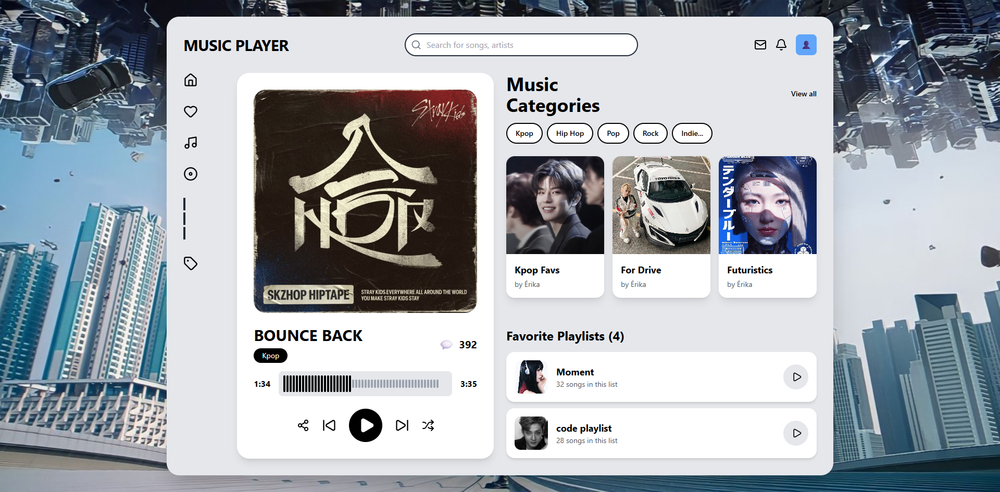

# Music Player 🎵

<div align="center">


**Interface moderna de music player com design inspirado em plataformas de streaming 🎧**

Aplicação web com interface visual de player e gerenciamento de playlists

</div>

---

## Sobre o Projeto

**Music Player** é uma aplicação web moderna que simula uma plataforma de streaming de música. O projeto apresenta um design limpo e intuitivo, com funcionalidades de player, categorias musicais e gerenciamento de playlists favoritas.

### Características Principais

- Interface de usuário moderna e intuitiva
- Player de música funcional com controles completos
- Sistema de categorias musicais (Kpop, Hip Hop, Pop, Rock, Indie)
- Gerenciamento de playlists favoritas
- Barra de busca para pesquisa de músicas e artistas
- Design parcialmente responsivo
- Navegação lateral com ícones interativos
- Performance otimizada com Vite

---

## Tecnologias Utilizadas

- **[React](https://react.dev/)** - Biblioteca JavaScript para construção de interfaces
- **[Vite](https://vitejs.dev/)** - Build tool moderna e extremamente rápida
- **[Tailwind CSS](https://tailwindcss.com/)** - Framework CSS utility-first para estilização rápida
- **[Lucide React](https://lucide.dev/)** - Biblioteca de ícones moderna e personalizável
- **[ESLint](https://eslint.org/)** - Linter para manter código limpo e padronizado
- **[PostCSS](https://postcss.org/)** - Ferramenta para transformar CSS
- **[Autoprefixer](https://github.com/postcss/autoprefixer)** - Adiciona prefixos de fornecedores automaticamente

---

## Preview

<div align="center">



</div>

---

## Funcionalidades

### Player de Música
- Reprodução de faixas
- Controles de play/pause, próxima e anterior
- Barra de progresso interativa
- Exibição de tempo atual e duração total
- Modo shuffle e repeat

### Navegação
- Sidebar com navegação principal
- Ícones para Home, Favoritos, Músicas e Descobrir
- Sistema de notificações e perfil de usuário

### Playlists
- Visualização de playlists favoritas
- Categorias musicais organizadas
- Cards personalizados para cada playlist
- Contador de músicas por playlist

### Busca
- Barra de pesquisa integrada
- Busca por músicas e artistas

---

## Como Rodar o Projeto

### Pré-requisitos

- Node.js (versão 18 ou superior)
- npm ou yarn

### Instalação

1. **Clone o repositório**

```bash
git clone https://github.com/erikalaiane/music-player.git
```

2. **Entre no diretório do projeto**

```bash
cd music-player
```

3. **Instale as dependências**

```bash
npm install
```

4. **Inicie o servidor de desenvolvimento**

```bash
npm run dev
```

5. **Abra no navegador**

Acesse [http://localhost:5173](http://localhost:5173)

---

## Scripts Disponíveis

```bash
npm run dev      # Inicia servidor de desenvolvimento
npm run build    # Cria build de produção
npm run preview  # Preview da build de produção
npm run lint     # Executa o linter
```

---

## Estrutura do Projeto

```
music-player/
├── public/
│   └── images/          # Imagens do site
│       └── site.png
├── src/
│   ├── App.jsx          # Componente principal
│   ├── main.jsx         # Ponto de entrada
│   └── index.css        # Estilos globais
├── index.html
├── package.json
├── tailwind.config.js   # Configuração do Tailwind
└── vite.config.js       # Configuração do Vite
```

---

## Responsividade

O projeto é parcialmente responsivo e testado em:

- Tablet (768px - 1023px)
- Desktop (1024px+)
- Large Desktop (1440px+)

---

## Contribuindo

Contribuições são sempre bem-vindas! Para contribuir:

1. Faça um fork do projeto
2. Crie uma branch para sua feature (`git checkout -b feature/MinhaFeature`)
3. Commit suas mudanças (`git commit -m 'Adiciona nova feature'`)
4. Push para a branch (`git push origin feature/MinhaFeature`)
5. Abra um Pull Request

---

## Melhorias Futuras

- [ ] Integração com API de música real
- [ ] Sistema de autenticação de usuários
- [ ] Criação e edição de playlists personalizadas
- [ ] Sistema de favoritos e curtidas
- [ ] Modo escuro/claro
- [ ] Compartilhamento de músicas e playlists
- [ ] Histórico de reprodução
- [ ] Recomendações personalizadas

---

## Autor(a)

**Seu Nome**

[](https://github.com/erikalaiane)
[](https://www.linkedin.com/in/erika-laiane-azevedo)
[](mailto:erikalaianeazevedosantos@gmail.com)

---

<div align="center">

Desenvolvido com 💜 por Érika Laiane

</div>
